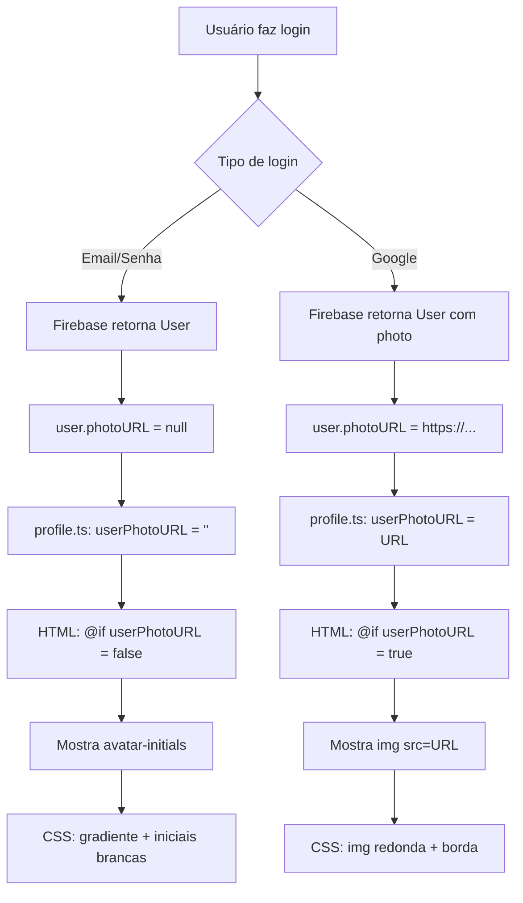

# 🐛 Troubleshooting - Foto de Perfil não Aparece

## 🔍 Problema Reportado

A foto do perfil parou de aparecer no header da aplicação após implementação do Realtime Database.

## 📊 Comportamento Esperado

### Login com Email/Senha:
- ✅ Avatar mostra **iniciais** (exemplo: "JO" para "joao@email.com")
- ❌ **NÃO** mostra foto (Firebase Auth não fornece foto para email/senha)
- ✅ Gradiente coral/orange no fundo do avatar
- ✅ Iniciais em branco, centralizadas

### Login com Google:
- ✅ Avatar mostra **foto do perfil do Google**
- ✅ Foto redonda, 36x36px
- ✅ Borda branca e sombra
- ✅ No dropdown, foto maior (48x48px)

## 🔧 Como Diagnosticar

### Passo 1: Verificar Logs no Console

1. Abra Developer Tools (F12)
2. Vá para aba **Console**
3. Faça login
4. Procure por estes logs:

```
🔐 Firebase Auth User Data: {
  uid: "abc123...",
  displayName: "Nome" ou null,
  email: "email@example.com",
  photoURL: "https://..." ou null,
  phoneNumber: null
}

💾 Saving user data to Database: {...}
✅ User data saved to Realtime Database: abc123

🔍 Profile Component - User Data: {
  displayName: "Nome",
  email: "email@example.com",
  photoURL: "https://..." ou null,
  uid: "abc123"
}

📸 Photo URL being set: "https://..." ou ""
```

### Passo 2: Ativar Debug Visual

No arquivo [profile.html](src/app/shared/components/header/widgets/profile/profile.html), linha 11-15:

**Remova os comentários:**

```html
<div style="position: fixed; top: 60px; right: 10px; background: #000; color: #fff; padding: 10px; z-index: 9999; font-size: 10px;">
  <div>photoURL: {{ userPhotoURL || 'EMPTY' }}</div>
  <div>initials: {{ userInitials }}</div>
  <div>name: {{ userDisplayName }}</div>
</div>
```

Isso mostrará um painel preto no canto superior direito com:
- `photoURL`: URL da foto ou "EMPTY"
- `initials`: Iniciais calculadas (ex: "JO")
- `name`: Nome do usuário

### Passo 3: Inspecionar o Elemento

1. Clique com botão direito no avatar
2. Selecione **Inspecionar Elemento**
3. Verifique a estrutura HTML:

**Se mostrar iniciais (correto para email/senha):**
```html
<div class="user-avatar">
  <div class="avatar-initials">JO</div>
</div>
```

**Se mostrar foto (correto para Google):**
```html
<div class="user-avatar">
  
</div>
```

### Passo 4: Verificar CSS

No DevTools, com o elemento selecionado, verifique os estilos aplicados:

**`.user-avatar` deve ter:**
```css
width: 36px;
height: 36px;
border-radius: 50%;
background: linear-gradient(135deg, #ff5c41 0%, #ff8c41 100%);
border: 2px solid #fff;
box-shadow: 0 2px 8px rgba(0, 0, 0, 0.1);
display: flex;
align-items: center;
justify-content: center;
```

**`.avatar-initials` deve ter:**
```css
color: #fff;
font-weight: 600;
font-size: 14px;
text-transform: uppercase;
letter-spacing: 0.5px;
```

## 🚨 Problemas Comuns e Soluções

### Problema 1: Iniciais não aparecem (avatar vazio/branco)

**Causa:** CSS não carregado ou `userInitials` está vazio

**Solução:**
1. Verifique se `userInitials` tem valor no debug
2. Se vazio, problema no método `getInitials()`
3. Se tem valor, problema no CSS

**Verificar:**
```typescript
// No profile.ts, linha 60-67
private getInitials(name: string): string {
  if (!name) return "U";
  const parts = name.split(" ");
  if (parts.length >= 2) {
    return (parts[0][0] + parts[1][0]).toUpperCase();
  }
  return name.substring(0, 2).toUpperCase();
}
```

**Teste manual no console:**
```javascript
// Cole no console do navegador
const name = "joao@email.com".split("@")[0];
console.log(name); // "joao"
console.log(name.substring(0, 2).toUpperCase()); // "JO"
```

### Problema 2: Avatar não aparece (nem iniciais nem foto)

**Causa:** `isAuthenticated` é `false` ou componente não renderiza

**Solução:**
1. Verifique se você está logado (token válido)
2. Veja logs: `🔍 Profile Component - User Data`
3. Se não aparecer, problema no Observable `user$`

**Verificar autenticação:**
```typescript
// Cole no console do navegador quando logado
// (precisa ter acesso ao Angular context)
```

Ou simplesmente veja se o log aparece no console.

### Problema 3: Foto do Google não carrega (quebrada)

**Causa:** URL inválida ou CORS issue

**Solução:**
1. Copie a URL da foto do console
2. Cole em nova aba do navegador
3. Se não carregar, problema no Google

**URL típica do Google:**
```
https://lh3.googleusercontent.com/a/AEdFTp5Qzw...
```

**Verificar no HTML:**
```html
<!-- Deve ter src válido -->

```

### Problema 4: Avatar aparece mas dropdown não

**Causa:** NgBootstrap não inicializado ou módulo não importado

**Solução:**
Verifique [profile.ts](src/app/shared/components/header/widgets/profile/profile.ts), linha 15:

```typescript
imports: [FeatherIcons, NgbDropdownModule, CommonModule],
```

Deve ter `NgbDropdownModule`.

### Problema 5: Iniciais aparecem mas sem fundo colorido

**Causa:** CSS do gradiente não aplicado

**Solução:**
Verifique [profile.scss](src/app/shared/components/header/widgets/profile/profile.scss), linha 37-47:

```scss
.user-avatar {
  background: linear-gradient(135deg, #ff5c41 0%, #ff8c41 100%);
}
```

Se o gradiente não aparecer, pode ser problema de build ou cache do navegador.

**Forçar reload:**
- Windows: `Ctrl + Shift + R`
- Mac: `Cmd + Shift + R`

## 🧪 Testes Passo a Passo

### Teste 1: Login com Email/Senha

1. Vá para `/page/other-pages/log-in`
2. Preencha:
   - Email: `teste@email.com`
   - Senha: `senha123` (mínimo 6 caracteres)
3. Clique em "Log in"

**Resultado Esperado:**
- Console mostra: `photoURL: null`
- Header mostra avatar circular com iniciais "TE"
- Fundo gradiente coral/orange
- Iniciais brancas, centralizadas

### Teste 2: Login com Google

1. Vá para `/page/other-pages/log-in`
2. Clique em "Login with Google"
3. Selecione conta Google

**Resultado Esperado:**
- Console mostra: `photoURL: https://lh3.googleusercontent.com/...`
- Header mostra foto do perfil do Google
- Foto redonda, 36x36px
- Borda branca e sombra

### Teste 3: Dropdown

1. Com usuário logado, clique no avatar
2. Dropdown abre

**Resultado Esperado:**
- Header do dropdown mostra:
  - Avatar maior (48x48px)
  - Nome do usuário
  - Email do usuário
- 4 opções de menu:
  - Dashboard
  - Meu Perfil
  - Favoritos
  - Sair (vermelho)

## 🔄 Reset Completo

Se nada funcionar, tente reset completo:

### 1. Limpar Cache do Navegador

1. Abra DevTools (F12)
2. Clique com botão direito no botão de reload
3. Selecione "Empty Cache and Hard Reload"

### 2. Limpar Build do Angular

```bash
# Pare o servidor
Ctrl + C

# Delete pasta .angular
rm -rf .angular

# Delete node_modules/.cache
rm -rf node_modules/.cache

# Rebuild
npm run build

# Start novamente
npm start
```

### 3. Logout e Login Novamente

1. Se logado, faça logout
2. Limpe localStorage:
   ```javascript
   // Cole no console do navegador
   localStorage.clear();
   sessionStorage.clear();
   ```
3. Recarregue página (F5)
4. Faça login novamente

### 4. Verificar Firebase Console

1. Acesse: [Firebase Console](https://console.firebase.google.com/)
2. Selecione projeto: `fed-catalogo-arquitetura`
3. Vá em **Authentication** → **Users**
4. Veja lista de usuários cadastrados
5. Clique em um usuário
6. Verifique se `photoURL` existe (para Google) ou está vazio (para email)

## 📋 Checklist de Verificação

Use este checklist para diagnosticar:

- [ ] Console mostra logs de Firebase Auth User Data
- [ ] Console mostra logs de Profile Component
- [ ] Debug visual mostra valores corretos (photoURL, initials, name)
- [ ] Elemento HTML existe no DOM (inspecionar)
- [ ] CSS está aplicado (verificar estilos no DevTools)
- [ ] Usuário está autenticado (verificar Firebase Console)
- [ ] Build sem erros (`npm run build`)
- [ ] Servidor rodando sem erros (`npm start`)
- [ ] Navegador sem erros de console (F12)
- [ ] Cache do navegador limpo (hard reload)

## 💡 Entendendo o Fluxo



## 📞 Ainda com Problema?

Se após seguir todos os passos o problema persistir:

1. **Capture screenshots:**
   - Console com logs
   - DevTools com elemento inspecionado
   - Página mostrando o problema

2. **Exporte dados de debug:**
   ```javascript
   // Cole no console e copie o resultado
   console.log({
     isAuthenticated: !!firebase.auth().currentUser,
     currentUser: firebase.auth().currentUser,
     photoURL: firebase.auth().currentUser?.photoURL,
     displayName: firebase.auth().currentUser?.displayName,
   });
   ```

3. **Verifique versões:**
   ```bash
   npm list @angular/fire
   npm list @angular/core
   npm list @ng-bootstrap/ng-bootstrap
   ```

## ✅ Solução Funcionando

Quando tudo estiver funcionando, você deve ver:

**Console:**
```
🔐 Firebase Auth User Data: { uid, email, photoURL, ... }
💾 Saving user data to Database: { name, email, ... }
✅ User data saved
🔍 Profile Component - User Data: { ... }
📸 Photo URL being set: ...
```

**Visualmente:**
- ✅ Avatar circular no header (foto ou iniciais)
- ✅ Gradiente coral/orange (se iniciais)
- ✅ Foto do Google (se login com Google)
- ✅ Dropdown abre ao clicar
- ✅ Informações corretas no dropdown

## 🎯 Resumo

O comportamento atual está **correto**:
- Login com Email/Senha → **Iniciais**
- Login com Google → **Foto**

Se as iniciais não aparecem visualmente, o problema é de CSS ou renderização, não de lógica.

Use os logs de debug e o painel visual para identificar onde está o problema exato.
